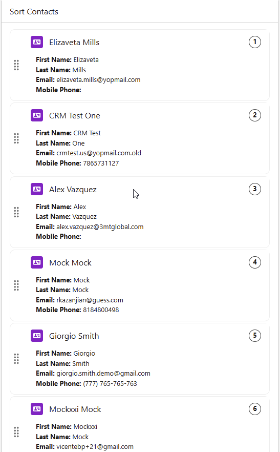
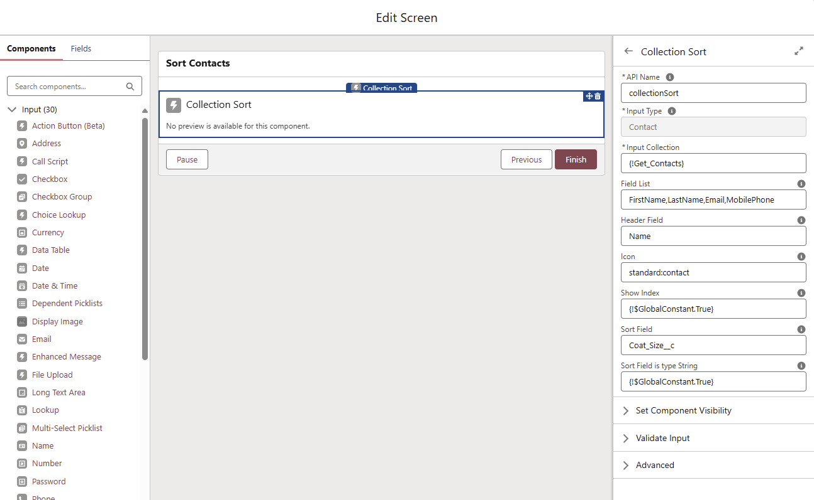

# Order Collection LWC Component



# Installation

## Install using SFDX:

```bash
sfdx force:source:deploy -u <org-alias> -p ./force-app
```

## Install Using Deploy To Salesforce

Click on this button to deploy to your org:

<a href="https://githubsfdeploy.herokuapp.com?owner=systemyc&repo=composer-api-playground&ref=main">
  
</a>

# Parameters



| Parameter    | Description |
| ------------ | ----------- |
| Input Collection | A collection of SObject records to be ordered    |
| Field List | Comma separated list of field API names to be showed for each record. If no value is provided, then all the fields in the collection will be showed |
| Header Field | The field within the collection that will be used as the header of the record in the list. If no value is specified then the Id of the record will be used |
| Icon | The icon for the records in the list. The format should be that of an SLDS icon (e.g. standard:contact, utility:record, etc.) |
| Sort Field | The field within the collection that will be used to first show the records ordered by this field, and then, once the collection is sorted, the field that will contain index representing the new position of the record within the list |
| Sort Field is type String | By default the Sort Field is of type number. If this is true then the data type of the Sort Field is treated as String |
| Show Index |Whether to show the numerical index of the record within the collection. By default the index is showed |


